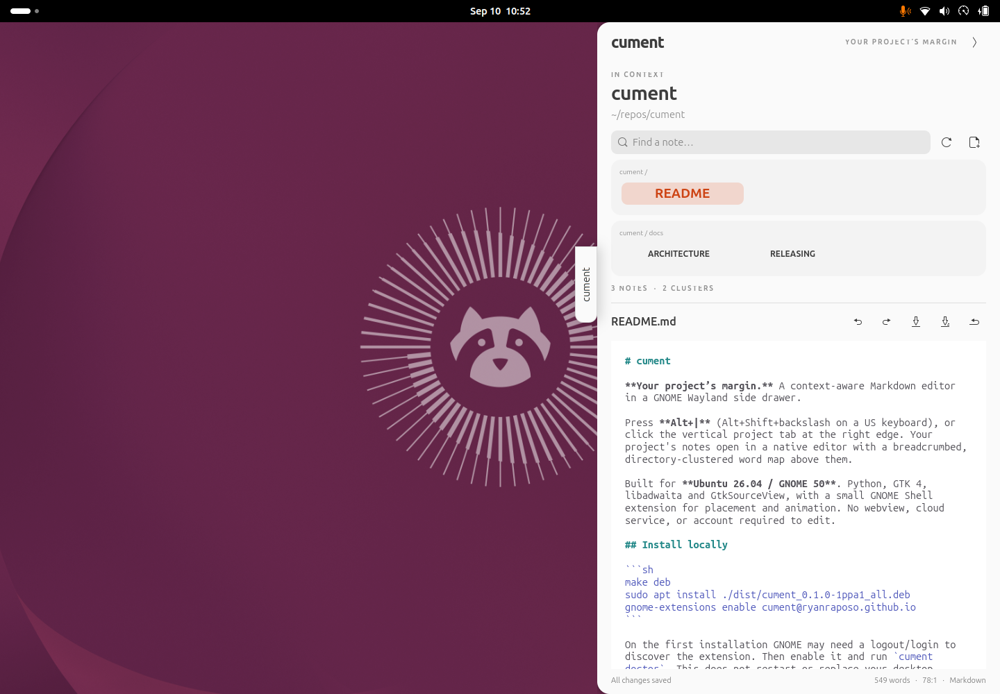

# cument

**Your project’s margin.** A context-aware Markdown editor in a GNOME Wayland side drawer.

Press **Alt+|** (Alt+Shift+backslash on a US keyboard), or click the vertical project tab at the right edge. Your project's notes open in a native editor with a breadcrumbed, directory-clustered word map above them.

Built for **Ubuntu 26.04 / GNOME 50**. Python, GTK 4, libadwaita and GtkSourceView, with a small GNOME Shell extension for placement and animation. No webview, cloud service, or account required to edit.



## Install locally

```sh
make deb
sudo apt install ./dist/cument_0.1.0-1ppa1_all.deb
gnome-extensions enable cument@ryanraposo.github.io
```

On the first installation GNOME may need a logout/login to discover the extension. Then enable it and run `cument doctor`. This does not restart or replace your desktop automatically.

## Follow your terminal

Add one line to your shell configuration:

```sh
# ~/.bashrc
eval "$(cument shell-init bash)"
# ~/.zshrc
eval "$(cument shell-init zsh)"
# ~/.config/fish/config.fish
cument shell-init fish | source
```

Open a new terminal. The hook publishes the project at each prompt and sets a title such as `cument — cument:12345`. The Shell extension uses that shell ID to distinguish terminal windows and tabs. Terminal title overrides, terminal multiplexers and remote SSH sessions may prevent automatic matching; `cument open /path/to/project` always selects explicitly. Set `CUMENT_TITLE=0` before the hook to keep your existing title and use explicit selection.

The project is the Git worktree root, the nearest directory containing a project marker, or the current directory. Git-ignored files, dependency directories, symlinks and files over 4 MiB are excluded. The map displays up to 500 files and is refreshed with its refresh button.

## Use

```sh
cument                       # toggle the current project
cument open                  # open the current project
cument open ~/repos/project  # choose a project
cument close
cument list --json
cument doctor
```

- **Ctrl+S** saves; edits also save after 900 ms of inactivity.
- **Ctrl+Z / Ctrl+Shift+Z** undo and redo.
- **Ctrl+P / Ctrl+F** search file names and titles in the map.
- **Ctrl+N** creates a Markdown file; paths such as `notes/idea.md` work.
- **Esc** closes the drawer and returns to the previous application.

The editor follows GNOME's light/dark appearance, accent and monospace font. The rest of the UI inherits the desktop UI font. Drawer animation respects GNOME's reduced-motion setting. Files changed externally reload when the buffer is clean; conflicting saves retain your edits and offer reload or save-a-copy controls. Failed saves write recovery copies to `$XDG_STATE_HOME/cument/recovery` (normally `~/.local/state/cument/recovery`). Markdown is edited as source with syntax highlighting; it does not execute embedded HTML.

## Develop and verify

```sh
sudo apt install python3-gi gir1.2-gtk-4.0 gir1.2-adw-1 gir1.2-gtksource-5 libglib2.0-bin
make test
scripts/test-shell.sh          # isolated Wayland integration tests (mutter-dev-bin required)
bin/cument _editor --project .  # standalone editor for UI development
```

The extension must run in a fresh GNOME process after JavaScript changes. Use an isolated nested GNOME 50 session for development; do not restart the host Wayland compositor. See [architecture](docs/ARCHITECTURE.md) and [release instructions](docs/RELEASING.md).

## Distribution status

The local `.deb` and Debian source packaging are provided. **A public PPA has not yet been published.** Once the release is accepted by Launchpad, installation will be:

```sh
sudo add-apt-repository ppa:ryanraposo/cument
sudo apt update
sudo apt install cument
```

An unconfigured Ubuntu installation will only find `cument` after admission to Ubuntu's official archive. A PPA is the initial distribution route, not official archive inclusion.

Copyright 2026 Ryan Raposo. GPL-3.0-or-later.
